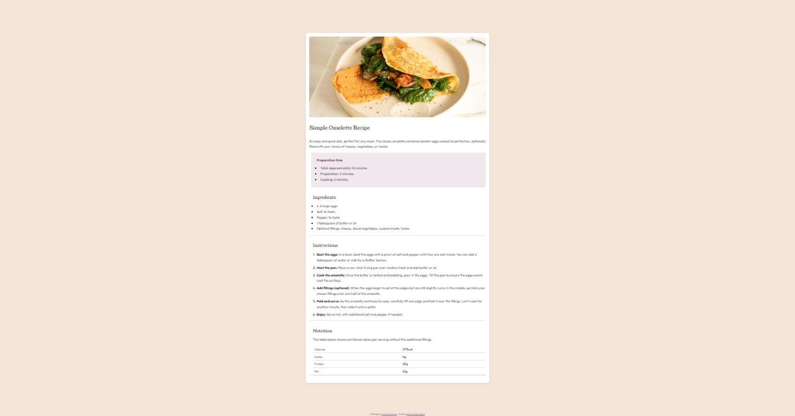

# Frontend Mentor - Recipe page solution

This is a solution to the [Recipe page challenge on Frontend Mentor](https://www.frontendmentor.io/challenges/recipe-page-KiTsR8QQKm). Frontend Mentor challenges help you improve your coding skills by building realistic projects.

## Table of contents

- [Frontend Mentor - Recipe page solution](#frontend-mentor---recipe-page-solution)
  - [Table of contents](#table-of-contents)
  - [Overview](#overview)
    - [Screenshot](#screenshot)
    - [Links](#links)
  - [My process](#my-process)
    - [Built with](#built-with)
    - [What I learned](#what-i-learned)
    - [Continued development](#continued-development)
  - [Author](#author)

## Overview

### Screenshot



### Links

- Solution URL: [Solution](https://github.com/kelton-glitch/Recipe-main-page)
- Live Site URL: [Live Site](https://main--recipemainpage.netlify.app)

## My process

### Built with

- Semantic HTML5 markup
- CSS custom properties
- Flexbox
- CSS Grid
- Mobile-first workflow

### What I learned

After some struggle with picking the elements on a side, I finally got it. It felt refreshing

```css
td:last-child {
    font-weight: bold;
    color: hsl(14, 45%, 36%);
}
```

### Continued development

I would like to focus more in the future on using components efficiently. The next project will most likely focus on that

## Author

- Frontend Mentor - [@kelton-glitch](https://www.frontendmentor.io/profile/kelton-glitch)
- Twitter - [@kelton194](https://www.twitter.com/kelton194)
- LinkedIn - [Elton Kamgo Njomo](https://www.linkedin.com/in/elton-kamgo-njomo-89ba66210)
